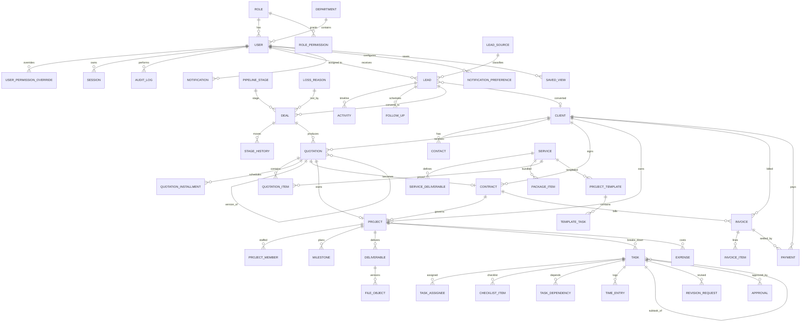

# Database ERD — Blue Point OS

المصدر الرسمي: `prisma/schema.prisma`. هذه الوثيقة ملخص للعلاقات وقواعد النمذجة.

## 1. قواعد النمذجة العامة

| القاعدة | التفصيل |
| --- | --- |
| المفاتيح | `String @id @default(cuid())` لكل الكيانات. |
| المال | `Int` بوحدة العملة الصغرى + حقل `currency` نصي (ISO-4217). لا `Float` مطلقًا. |
| النسب | `Decimal(9,4)` (ضريبة، خصم %، احتمالية). |
| الوقت | `DateTime @db.Timestamptz(3)`، UTC. |
| الحذف | `deletedAt DateTime?` (Soft Delete) على كل الكيانات المهمة + فهرس جزئي. |
| التتبع | `createdById`, `updatedById`, `createdAt`, `updatedAt`. |
| المرفقات | كيان `FileObject` متعدد الأشكال (`entityType` + `entityId`) مع إصدارات. |
| النشاط | كيان `Activity` متعدد الأشكال لتايم‑لاين موحّد لكل الكيانات. |

## 2. المخطط الرئيسي



## 3. الكيانات حسب المجال

| المجال | الكيانات |
| --- | --- |
| الهوية والصلاحيات | `Role`, `RolePermission`, `UserPermissionOverride`, `User`, `Department`, `Session`, `PasswordResetToken`, `LoginAttempt` |
| الإعدادات | `Setting`, `Currency`, `Country`, `TaxRate`, `NumberSequence`, `PipelineStage`, `LeadSource`, `LossReason`, `Tag`, `EntityTag` |
| CRM | `Lead`, `Activity`, `FollowUp`, `Deal`, `StageHistory` |
| العملاء | `Client`, `Contact` |
| الكتالوج | `Service`, `ServiceDeliverable`, `PackageItem` |
| المستندات التجارية | `Quotation`, `QuotationItem`, `QuotationInstallment`, `Contract`, `ContractService` |
| العمليات | `ProjectTemplate`, `TemplateTask`, `Project`, `ProjectMember`, `ProjectService`, `Milestone`, `Deliverable`, `Task`, `TaskAssignee`, `ChecklistItem`, `TaskDependency`, `TimeEntry`, `Comment`, `CommentMention` |
| المراجعة والاعتماد | `RevisionRequest`, `Approval` |
| الملفات | `FileObject`, `FileDownload` |
| المالية | `Invoice`, `InvoiceItem`, `Payment`, `Expense`, `CampaignPerformance` |
| الإشعارات | `Notification`, `NotificationPreference`, `JobRun` |
| الحوكمة | `AuditLog`, `SavedView`, `Favorite`, `RecentItem` |

## 4. الفهارس الأساسية

- `Lead`: `(assignedToId, status)`, `(nextFollowUpAt)`, `(phone)`, `(email)`, `(deletedAt)`، وفهرس بحث `GIN` على `search_vector` (تُملأ بـ trigger).
- `Deal`: `(stageId, ownerId)`, `(expectedCloseDate)`.
- `Task`: `(status, dueDate)`, `(projectId)`, وفهرس على `TaskAssignee(userId)`.
- `Invoice`: `(clientId, status)`, `(dueDate)`.
- `AuditLog`: `(entityType, entityId)`, `(userId, at)`.
- `Notification`: `(userId, readAt)`, unique على `dedupeKey`.

## 5. سياسات RLS

مفعّلة على: `Lead, Deal, Client, Quotation, Contract, Project, Task, Invoice, Payment, Expense, FileObject, AuditLog`.

آلية العمل:

```sql
-- التطبيق يتصل بدور bluepoint_app (NOBYPASSRLS)
SET LOCAL app.user_id   = '<cuid>';
SET LOCAL app.scope_all = 'on|off';   -- من صلاحية Scope=ALL
SET LOCAL app.team_ids  = '<id1,id2>';
```

كل سياسة تسمح بالصف إذا: `app.scope_all = 'on'` أو المالك/المسند = `app.user_id` أو المالك ضمن `app.team_ids`.
`AuditLog`: `SELECT` فقط للتطبيق، و`INSERT` مسموح، و`UPDATE/DELETE` ممنوعان (`REVOKE`).
